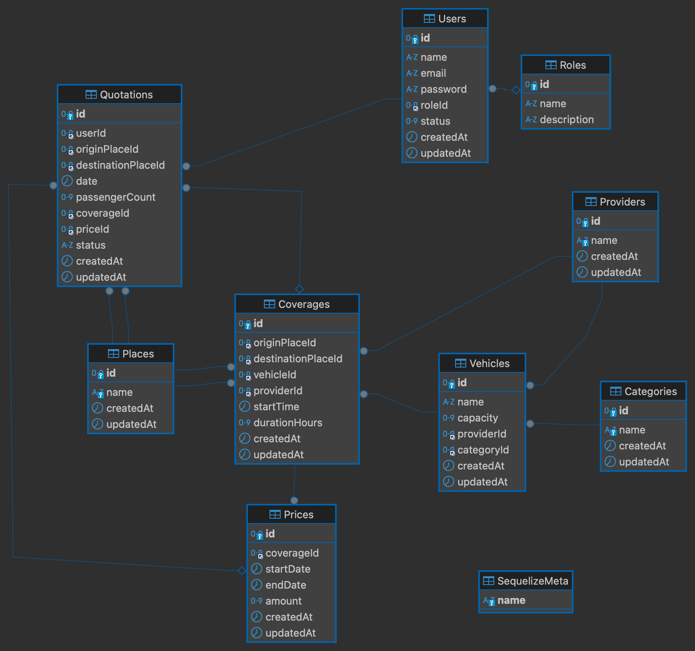
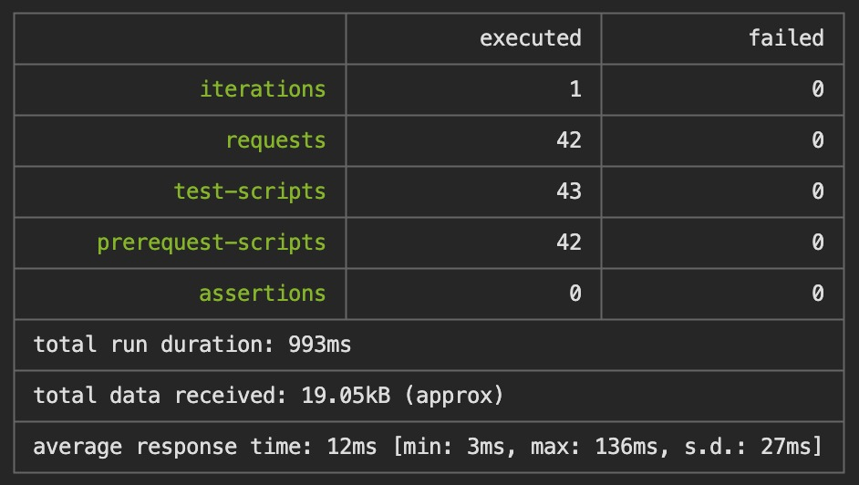

# Travel Quotation API
<div style="text-align: center;">
  
  
</div>

## Introduction

The Travel Quotation API is a RESTful service built with Node.js, Express, and Sequelize ORM, designed to handle travel quotations for a transportation service. This API allows users to create, update, and manage quotations, along with managing associated entities like Users, Places, Vehicles, Providers, Coverages, Prices, and Categories.

## Table of Contents
- [Technologies Used](#technologies-used)
- [Database Schema](#database-schema)
- [Setup and Installation](#setup-and-installation)
- [API Endpoints](#api-endpoints)
- [Test Coverage](#test-coverage)
- [Author](#author)

## Technologies Used

- **Node.js** - JavaScript runtime environment.
- **Express** - Web framework for Node.js.
- **Sequelize** - Promise-based Node.js ORM.
- **MySQL** - Relational database management system.
- **Docker** - Containerization platform.
- **Postman** - API development environment.

## Database Schema

The database schema consists of the following tables:



## Setup and Installation

### Prerequisites

- Node.js (v16+)
- Docker
- Docker Compose

### Installation

1. **Clone the repository:**

   ```bash
   git clone https://github.com/GerardoAmaya/travel-quote-api.git
   cd travel-quotation-api
   ```

2. **Install dependencies:**

   ```bash
    npm install
    ```

3. **Build and run the Docker containers:**

   ```bash
    docker-compose up -d
   ```

4. **Run the migrations and seeders:**

    ```bash
    docker-compose exec app npm run db:setup
    ```

## API Endpoints

Here you can test the API endpoints using Postman:

[](https://documenter.getpostman.com/view/28143048/2sAXjM3BEA)

## Test Coverage

Using newman, we have run the tests and generated a report with the results.

<div style="text-align: center;">
  
</div>


## Author

**Gerardo Amaya** - gerardoamayasv2000@gmail.com


[](https://www.linkedin.com/in/gerardoalbertoamaya)
[](https://gerardoamayacv.info)
